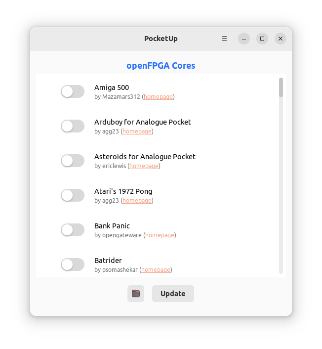

PocketUp
========
A forthcoming Linux GUI app to download and update openFPGA cores on the Analogue Pocket.

<div align="center">
    
</div>

Build
-----
Prerequisites for Debian/Ubuntu:

```shell
sudo apt install libgtk-4-dev build-essential
```

Prerequisites for Fedora:

```shell
sudo dnf install gtk4-devel gcc
```

Prerequisites for Arch:

```shell
sudo pacman -S gtk4 base-devel
```

Then to build:

```shell
mkdir -p $HOME/.local/share/glib-2.0/schemas
cp resources/com.radioactivehamster.pocket_up.gschema.xml $HOME/.local/share/glib-2.0/schemas/
glib-compile-schemas $HOME/.local/share/glib-2.0/schemas/
cargo build --release
```

Install
-------
```shell
# Install not yet available.
```

License
-------
The MIT License. See the [license file](LICENSE) for details.
